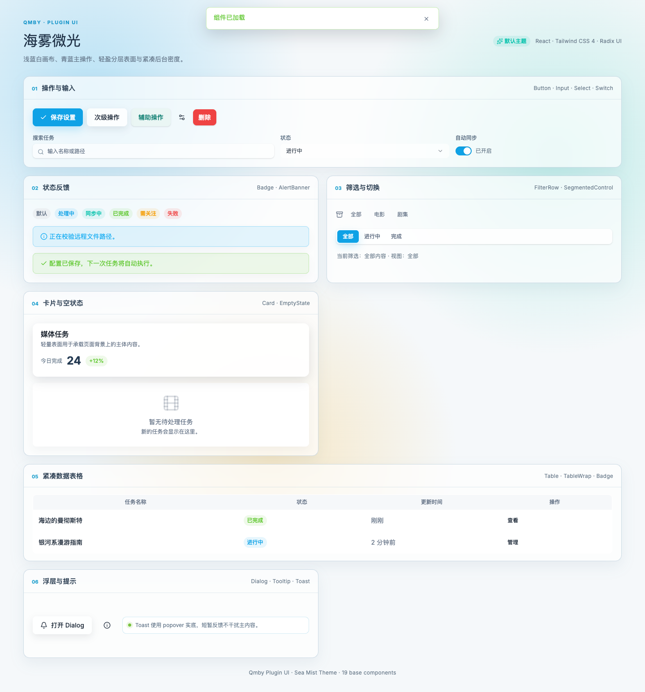

# Qmby Plugin UI

Qmby「海雾微光」主题的可复用 React + Tailwind UI 组件包。

这个目录可以直接复制到其他 React + TypeScript + Tailwind CSS 4 项目中使用，包含：

- 19 个基础 UI 组件
- 海雾微光浅色 / 深色 Token
- `uiStyles` 表面样式变量
- `cn` class 合并工具
- Toast Context 与 Provider
- 设计规范和页面组件抽取建议

## 视觉预览

下面的截图来自目录内真实组件源码，展示了海雾微光的常用控件、状态、表面和表格组合：



## 目录

```text
plugin-ui/
├── README.md
├── DESIGN_SYSTEM.md       # 完整组件库与页面规范
├── UI_STYLE.md            # 透明度、卡片和浮层规则
├── theme.css              # 海雾微光 Token 和全局背景
└── src/
    ├── index.ts           # 统一导出
    ├── components/ui/     # 基础组件
    └── lib/               # cn、uiStyles、toast
```

## 安装依赖

```bash
npm install react react-dom clsx tailwind-merge class-variance-authority lucide-react \
  @radix-ui/react-dialog @radix-ui/react-label @radix-ui/react-select \
  @radix-ui/react-separator @radix-ui/react-slot @radix-ui/react-toast \
  @radix-ui/react-tooltip
```

确保项目已经启用 Tailwind CSS 4，并在入口 CSS 中引入：

```css
@import "./plugin-ui/theme.css";
```

如果入口 CSS 不在 `plugin-ui` 的上级目录，请按实际路径调整。

## 使用

```tsx
import {
  AlertBanner,
  Badge,
  Button,
  Card,
  CardContent,
  CardHeader,
  CardTitle,
  Input,
  Table,
  TableCell,
  TableHead,
  TableHeaderCell,
  TableRow,
  TableWrap,
} from "./plugin-ui/src"

export function Example() {
  return (
    <Card>
      <CardHeader>
        <CardTitle>任务列表</CardTitle>
      </CardHeader>
      <CardContent className="space-y-4">
        <div className="flex gap-2">
          <Input placeholder="搜索任务" />
          <Button>新增任务</Button>
        </div>
        <AlertBanner variant="info">正在同步任务状态</AlertBanner>
        <TableWrap>
          <Table>
            <TableHead>
              <TableRow>
                <TableHeaderCell>名称</TableHeaderCell>
                <TableHeaderCell>状态</TableHeaderCell>
              </TableRow>
            </TableHead>
            <tbody>
              <TableRow>
                <TableCell>示例任务</TableCell>
                <TableCell><Badge variant="success">完成</Badge></TableCell>
              </TableRow>
            </tbody>
          </Table>
        </TableWrap>
      </CardContent>
    </Card>
  )
}
```

## 深色模式

给根节点加上 `dark` class 即可切换主题：

```tsx
document.documentElement.classList.toggle("dark", isDark)
```

## 组件列表

`Button`、`Card`、`Dialog`、`Input`、`Label`、`Select`、`Textarea`、`Switch`、`Badge`、`AlertBanner`、`EmptyState`、`Skeleton`、`Separator`、`Tooltip`、`ToastProvider`、`FilterRow`、`SegmentedControl`、`Table`、`Pagination`。

组件 API 和页面组合规则见 [DESIGN_SYSTEM.md](./DESIGN_SYSTEM.md)。

## 设计边界

- 组件只负责视觉和交互契约，不负责业务数据请求。
- 组件默认只包含海雾微光，不包含其他 Qmby 主题。
- Dialog、Select、Tooltip、Toast 等覆盖页面内容的浮层保持不透明。
- 业务页面应优先使用语义 Token 和 `uiStyles`，不要复制长的阴影和透明度 class。
