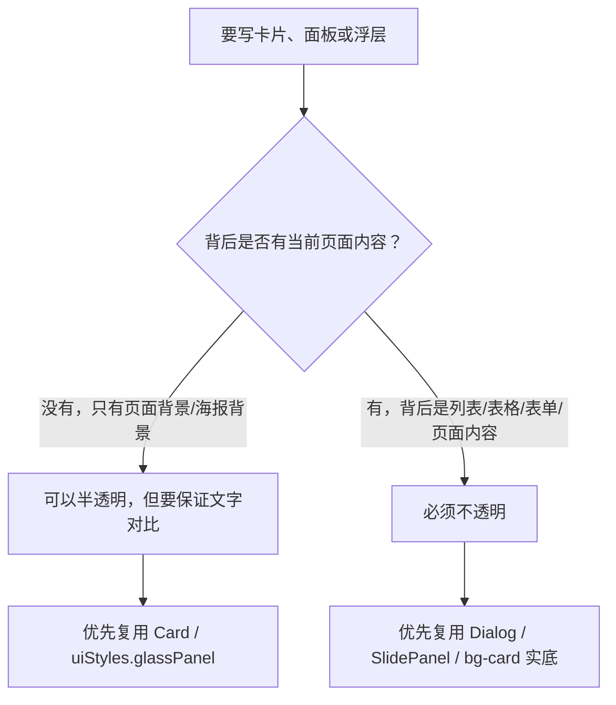

# Qmby 前端默认主题风格规范

默认主题「海雾微光」的关键词是：浅蓝白底、青蓝点缀、分层卡片、轻阴影、圆润但克制的后台工具界面。

## 基础规则

| 场景 | 统一用法 |
| --- | --- |
| 主容器 / 卡片 | 优先使用 `Card`。直接落在页面背景上的主体卡片可以半透明；覆盖在页面内容、列表、表格或表单上方的浮层卡片必须不透明。 |
| 消息 / 通知横幅 | 使用 `AlertBanner`，不要手写 success/error 的 border + bg + text class。 |
| 状态 / 类别标签 | 使用 `Badge`，语义色用 `primary`、`teal`、`blue`、`success`、`warning`、`destructive`。 |
| 空状态 | 使用 `EmptyState`。简单一句话和图标型空状态都由它承载。 |
| 表格 | 使用 `TableWrap`、`Table`、`TableHead`、`TableRow`、`TableCell` 等组合。 |
| 分页 | 使用 `Pagination`。 |
| 筛选行 | 使用 `FilterRow`。 |
| 分段按钮 / 切换组 | 使用 `SegmentedControl`。 |
| 开关 | 使用公共 `Switch`。关闭态统一为可见的中性灰轨道和白色滑块，不加明显描边；页面不得自行覆盖开关状态样式。 |
| 弹窗 / 抽屉 / 浮层 | 优先使用 `Dialog` 或 `SlidePanel`；主体必须使用不透明背景。必须自定义结构时，外层继续使用 `data-ui-slot="dialog-overlay"` / `data-ui-slot="dialog"`。 |

## 卡片透明度层级规则

所有新增或修改的前端页面都必须先判断卡片背后是什么，再决定背景透明度。

| 背后内容 | 允许样式 | 禁止样式 | 例子 |
| --- | --- | --- | --- |
| 页面背景、主题底纹、影视海报等不需要阅读的视觉背景 | 可以使用克制半透明，例如 `Card` 默认样式、`bg-card/45`、轻微 `backdrop-blur` | 透明度过低导致文字对比不足 | 页面主体卡片、整理任务卡片、文件列表主卡片、影视详情里的元信息标签 |
| 当前页面内容、表格、列表、表单、抽屉内容、弹窗后方内容 | 必须使用不透明背景，例如 `bg-card`、`bg-background`、`bg-popover` | `bg-card/xx`、`bg-background/xx`、`bg-popover/xx`、毛玻璃 | `DialogContent`、`SlidePanel`、移动端更多菜单、toast、tooltip、弹窗内的摘要卡片 |

判断流程：



注意：信息密度不是唯一判断标准。即使卡片内部是表格，只要卡片背后只是页面背景，也可以半透明；即使卡片内部内容很少，只要它覆盖在页面内容上，也不能半透明。

## 样式变量

统一样式 class 集中在 `src/lib/ui-style.ts`：

```ts
uiStyles.glassPanel
uiStyles.glassSubtle
uiStyles.surfaceInset
uiStyles.alert
uiStyles.empty
uiStyles.tableWrap
uiStyles.tableHead
uiStyles.tableRow
uiStyles.badge
uiStyles.filterShell
uiStyles.segmentShell
```

新增 UI 时优先复用这些变量或已有组件。不要在页面里继续复制类似 `shadow-[0_10px_30px_rgb(...)] bg-card/35 rounded-lg` 的长 class；浮层、弹窗、抽屉不要使用半透明背景。

## 默认主题视觉约束

1. 直接在页面背景上的主体卡片可使用克制半透明；弹窗、抽屉、菜单、toast 等压在页面内容上的面板必须不透明，避免背景内容透出影响可读性。
2. 主卡片保持 `rounded-xl`，按钮、输入、轻量容器保持 `rounded-lg`。
3. 阴影保持轻：主卡片用 `0 10px 30px rgb(15 23 42 / 0.08)`，弹窗可用更大的浮层阴影。
4. 页面标题维持 `text-2xl font-semibold tracking-tight text-muted-foreground`。
5. 区块标题维持 `text-base font-semibold text-muted-foreground`。
6. 表格、筛选、分页保持后台工具的紧凑密度，不做营销式大间距。

## 新增页面检查表

1. 页面头是否使用统一标题层级和右侧操作按钮布局。
2. 卡片是否使用 `Card`；浮层类面板是否没有覆盖成半透明背景。
3. 状态标签是否使用 `Badge`。
4. 空状态是否使用 `EmptyState`。
5. 表格和分页是否使用统一组件。
6. 消息条是否使用 `AlertBanner`。
7. 筛选项是否使用 `FilterRow` 或 `SegmentedControl`。
8. 开关是否复用公共 `Switch`，并保持统一的开启/关闭状态样式。
